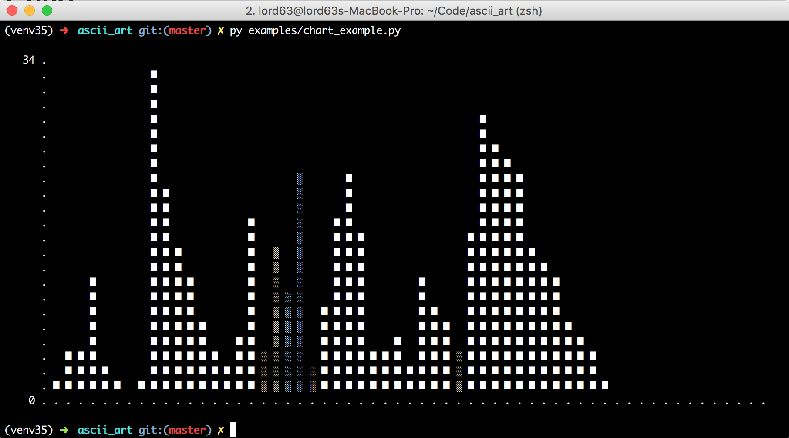

Ascii Art
=========

|Build Status| |Coverage Status|

::

                    _ _              _
      __ _ ___  ___(_|_)   __ _ _ __| |_
     / _` / __|/ __| | |  / _` | '__| __|
    | (_| \__ \ (__| | | | (_| | |  | |_
     \__,_|___/\___|_|_|  \__,_|_|   \__|

Draw ascii art(bar, chart, histogram) in your terminal. We love terminal, right? :)

Install
-------

::

    $ pip install ascii_art

Usage
-----

see examples folder.

Contribute
----------

* It sucks? Why not help me improve it? Let me know the bad things.
* Want a new feature? Feel free to file an issue for a feature request.
* Find a bug? Open an issue please, or it's better if you can send me a pull request.

Contributions are always welcome at any time! :sparkles: :cake: :sparkles:

Kudos
-----

It's a python port of the original chart_, bars_ and histogram_, all the glories should belong to tj_.

License
-------

MIT © lord63_.

.. _chart: https://github.com/jstrace/chart
.. _bars: https://github.com/jstrace/bars
.. _histogram: https://github.com/jstrace/histogram
.. _tj: https://github.com/tj
.. _lord63: https://github.com/lord63
.. |Build Status| image:: https://travis-ci.org/lord63/ascii_art.svg
   :target: https://travis-ci.org/lord63/ascii_art
.. |Coverage Status| image:: https://codecov.io/github/lord63/ascii_art/coverage.svg?branch=master
   :target: https://codecov.io/github/lord63/ascii_art?branch=master

